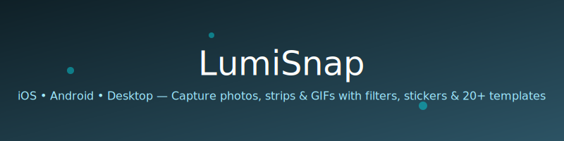

<p align="center">
  
</p>

## 📸 LumiSnap - iOS, Android, and Laptop
A feature-rich, mobile-first photo booth web app built with React + TypeScript. Take single shots, animated photo strips, and GIFs directly in your browser, no installation required.

<div align="center">
 


</div>

---

## 📁 Project Structure
 
```             
├── assets/
├── nodemodules/
├── src/
│   ├── components/
│   │   ├── CameraPreview.tsx   
│   │   ├── CaptureButton.tsx   
│   │   ├── ControlBar.tsx      
│   │   ├── CountdownOverlay.tsx
│   │   ├── FilterSelector.tsx  
│   │   ├── FlashOverlay.tsx    
│   │   ├── GalleryDrawer.tsx   
│   │   ├── GifRecordingOverlay.tsx 
│   │   ├── GifResultModal.tsx  
│   │   ├── Header.tsx          
│   │   ├── QRDownloadModal.tsx 
│   │   ├── StickerLayer.tsx    
│   │   ├── StickerPicker.tsx   
│   │   ├── StripProgress.tsx   
│   │   ├── StripResultModal.tsx
│   │   └── StripTemplateBar.tsx
│   ├── hooks/
│   │   ├── useCamera.ts        
│   │   ├── useCountdown.ts     
│   │   ├── useGallery.ts       
│   │   ├── useGifRecorder.ts   
│   │   └── useStickers.ts      
│   ├── services/
│   │   ├── cameraService.ts    
│   │   └── storageService.ts   
│   ├── types/
│   │   └── index.ts            
│   ├── utils/
│   │   ├── filters.ts          
│   │   ├── gifEncoder.ts       
│   │   ├── photoUtils.ts       
│   │   ├── qrCode.ts           
│   │   ├── StripTemplates.ts   
│   │   └── stickers.ts         
│   ├── App.tsx                 
│   ├── main.tsx                
│   └── index.css               
└── index.html                  
```

---

## 🚀 Getting Started
```bash
# Clone the repository
git clone https://github.com/your-username/lumisnap.git
cd lumisnap
 
# Install dependencies
npm install
 
# Start development server
npm run dev
```

---

## 🎨 Filters

6 real-time CSS + canvas filters applied both to the live preview and the final captured image:
- **Normal**  — no filter
- **B&W**     — full grayscale conversion
- **Sepia**   — warm sepia tone
- **Vintage** — warm tint with vignette overlay
- **Punch**   — high contrast + saturated
- **Mirror**  — horizontal flip

## 😄 Stickers

- 30+ emoji stickers across 4 categories: **Fun**, **Faces**, **Props**, **Love**
- **Drag** to reposition anywhere on the frame
- **Scale** with +/− buttons or mouse wheel
- **Rotate** freely with drag handle
- Stickers are **baked into the final photo** on capture (rendered directly to canvas)
 
## ⏱️ Countdown Timer

- Toggle on/off
- Choose 3s or 5s delay
- Animated fullscreen countdown overlay with "SMILE!" prompt
 
## 🖼️ Gallery

- View all captured **photos**, **strips**, and **GIFs** in a tabbed drawer
- **Download** any item as PNG or GIF
- **QR code** generator for quick mobile download of individual photos
- **Delete** individual items or clear all

## 🔒 Privacy

LumiSnap runs entirely in your browser:
- **No server** zero backend, zero data transmission
- **No analytics** no tracking scripts
- **Camera feed** never leaves your device
- **Photos stored locally** - in `localStorage` only
- **QR code feature** encodes a thumbnail fragment locally — no upload
 
---

<div align="center">
  <p>Made with ❤️</p>
  <p>
    <strong>LumiSnap</strong> capture the moment, keep the vibe.
  </p>
</div>
